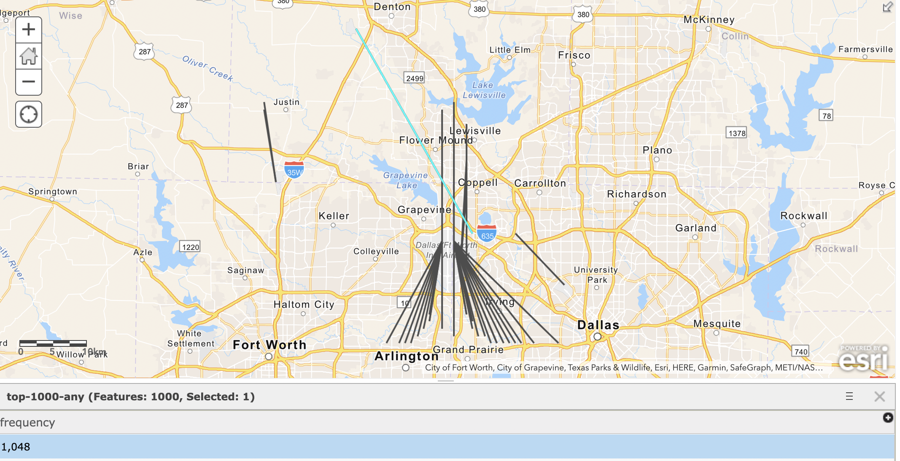

# Aircraft Traffic Routes Analysis

## Presentation (recommended)
Slide deck that summarizes implementation and results found [here](./docs/final-presentation.pdf)

A more detailed write-up is found [here](./docs/kurrack-final-write-up.pdf)

## Summary
I utilized available flight location data to find the most heavily traveled segments of the skies that corrospond to defined routes that planes generally use.

#### Architecutre Diagram


## Data
ADS-B Exchange provides snapshots of global flight data every 5 seconds. They provide this data for free download from the first of every month. Available here: https://www.adsbexchange.com/data/#sample

## Implementation

### Step 1 -- Download
I downloaded the ASD-B snapshot data from the 1st of the past 12 months (available as gzip archives), and extracted the raw json files. (See [code](./gen_segments/get_files.py)) script.)

### Step 2 -- Convert JSON to CSV
I wrote a python script to load each JSON file into memory and write the relevant fields to a CSV file. Notably, I only wrote records to the CSV files that had non-null values for each of those relevant fields; otherwise the record was discarded. (See [code](./json_to_csv/process_full.py))

### ~~Step 3 -- Flight Segment Transformation~~

This step was reworked in MapReduce (Step 5). Original description:

I transformed the snapshot data into spacial flight segments. Look at 2 consecutive snapshots, and find all planes that are in both snapshots. The flight segment for that plane is the location data (coordinates) from both snapshots: `Loaction1<latitude, longitude>, Location2<latitude, longitude>`. When considering the segements between snapshots, 5 seconds is too little time for planes to move a useful distance to be tracked. So, I chose to iterate through the snapshots in steps of 5 minutes to allow for significant flight segments to form. (I also iterate through the snapshots with every offset between 0 and 300 seconds to ensure I do not miss flight segments because they didn't happen during a time divisable by 5 minutes. For example, you can count by 5 starting at 0,1,2,3,4 as to hit every number between 0 and 100.)

For latitude and longitude, 2 degress of precision means the location is accurate to within 1.11 kilometers (according to http://wiki.gis.com/wiki/index.php/Decimal_degrees). This was a jusgment call in conjunction with selecting 5 minute intervals for flight segments. The precision of coordinates and length of interval could be an area for optimization.

[original code](./gen_segments/process.py)

### MapReduce

I used a chain job to run several mappers before and after my main reducer step.

#### Step 3 -- MapReduce Mapper

I wrote a MapReduce job (mapper only) to round the latitude and longitude coordinates of each records to 2 decimal places. I chose to do this because routing to 2 decimals places means the coordinates are accurate within 500 meters of error. This is sufficient for looking at 5 minute segments (discussed further in next step) so that the flight path is represented while allowing for similar paths (within 500 meters) to be aggregated together.

(See [code](./mr_chain/src/clean/RoundCoordinatesMapper.java))

#### Step 4 -- MapReduce Mapper + Reducer

I wrote a MapReduce job (mapper + reducer) to transform the “snapshots,” an aircraft’s current location at a timestamp, to “segments,” an aircraft’s start and end location over a specific interval. (I chose 5 minute intervals somewhat arbitrarily after trying different values and examining the segments that resulted from the transformation process.)

(See [mapper](./mr_chain/src/gensegments/GenSegmentsMapper.java) and [reducer](./mr_chain/src/gensegments/GenSegmentsReducer.java))

#### Step 5 -- MapReduce Mapper

I wrote a MapReduce job (mapper only) to remove flight segments where the start and end coordinates were the same, which meant that the aircraft was stationary. (This occurs often when plane are on the ground at an airport shortly before takeoff/after landing, but the radar is still tracking the plane’s location.)

(See [code](./mr_chain/src/clean/RemoveStationaryMapper.java))

### Hive

#### Step 6 -- Load Hive Tables

I loaded the output of the last MapReduce job into Hive as an external table (simply pointing Hive to the HDFS directory of Step 4’s output). I also created a “metadata” table in Hive from the output of Step 1 that contained static attributes of a flight (such as aircraft type). This was a “SELECT DISTINCT” query that yielded 1 row of metadata for every flight (identified by hex id).

##### Tables

```
CREATE EXTERNAL TABLE at_seg(id STRING, seg STRING, dist FLOAT)
ROW FORMAT DELIMITED FIELDS TERMINATED BY '\t' STORED AS TEXTFILE
LOCATION '/user/ntk9692/air-traffic/mr_chain/output-final2';
```

```
insert overwrite directory '/user/ntk9692/air-traffic/hex-metadata-1'
ROW FORMAT DELIMITED FIELDS TERMINATED BY '\t' STORED AS TEXTFILE
SELECT hex, aircraft FROM snapshots GROUP BY hex, aircraft;
```

```
CREATE EXTERNAL TABLE hex_meta(id STRING, aircraft STRING)
ROW FORMAT DELIMITED FIELDS TERMINATED BY '\t' STORED AS TEXTFILE
LOCATION '/user/ntk9692/air-traffic/hex-metadata-1';
```

#### Step 7 -- Execute Hive Queries

I executed several Hive queries on the joined data from both table described in Step 5. These queries returned the top 100 flight segments for certain conditions (such as in the NYC area) which were determined by counting the frequency of that segment in the dataset of all segments.

##### Queries

```
SELECT seg, count(*) as num_flights FROM at_seg
GROUP BY seg ORDER BY num_flights DESC LIMIT 10;
```

```
SELECT seg, count(*) as num_flights FROM at_seg
WHERE dist > 0.1
GROUP BY seg ORDER BY num_flights DESC LIMIT 1000;
```

```
hive -e 'use ntk9692; SELECT seg, count(*) as num_flights FROM at_seg WHERE dist > 0.1 GROUP BY seg ORDER BY num_flights DESC LIMIT 1000;'  | sed 's/[\t]/,/g'  > top-1000.csv
```

### Step 8 -- Map Results in ArcGIS

I wrote a python script to transform the flight segments returned by the queries into geoJSON, which can be imported directly into ArcGIS online, a web-based mapping software. The maps with resulting segments are included in the next sections.

## Visualizations

Maps generated in ArcGIS

https://www.arcgis.com/home/webmap/viewer.html?webmap=4e52e534d7d04ba9b706a066876cde7f
https://www.arcgis.com/home/webmap/viewer.html?webmap=57d15b5f7a304ebab9dba322d9c34700

#### Highest traveled



#### NYC Area


